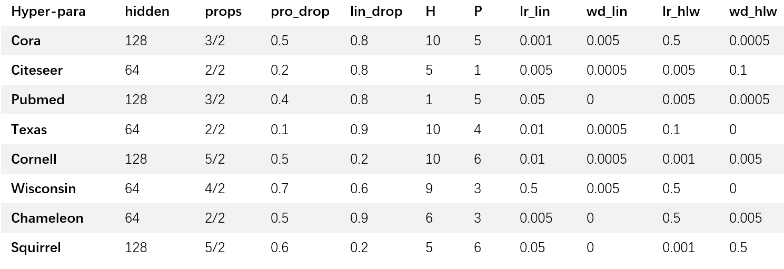
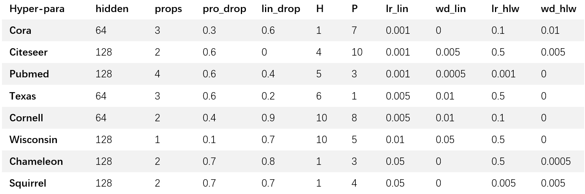
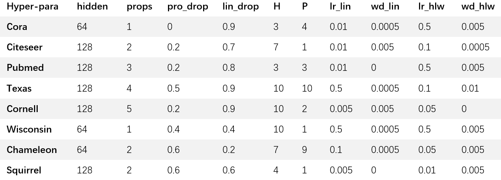
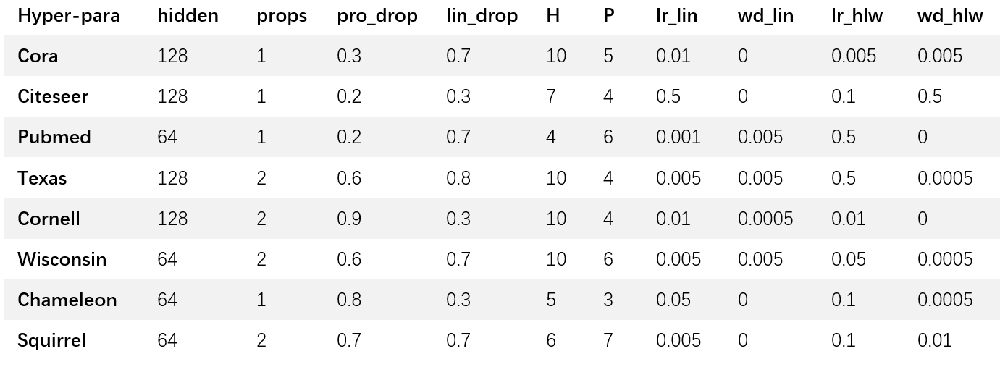

## LWPCGR: Unifying Over-smoothing and Over-squashing on Graphs via Path Curvature-based Graph Rewiring

### Requirements:
python == 3.10.0

torch == 1.12.1

dgl == 0.9.0

numpy==1.24.0

pandas==2.2.2

### Results:
Note that the hyper-parameters (in our paper) need to be adjusted manually.
Different versions of DGL and PyTorch can affect model performance, and fine-tuning of 
parameters, including but not limited to hyperparameters and seeds, may be required in 
order to reproduce the effects in this paper.

### Path Curvature-based Graph Rewiring (PCGR)
We run 'pcgr_training' to get the results of LWPCGR-GNN.  

### Citation: if using this code, please cite this paper.

### Hyper-parameters:
LWPCGR crosses GCNs for 10 random splits:

LWPCGR crosses SAGE for 10 random splits:

LWPCGR crosses GCNs for 100 fixed splits:

LWPCGR crosses SGC for 100 fixed splits:

